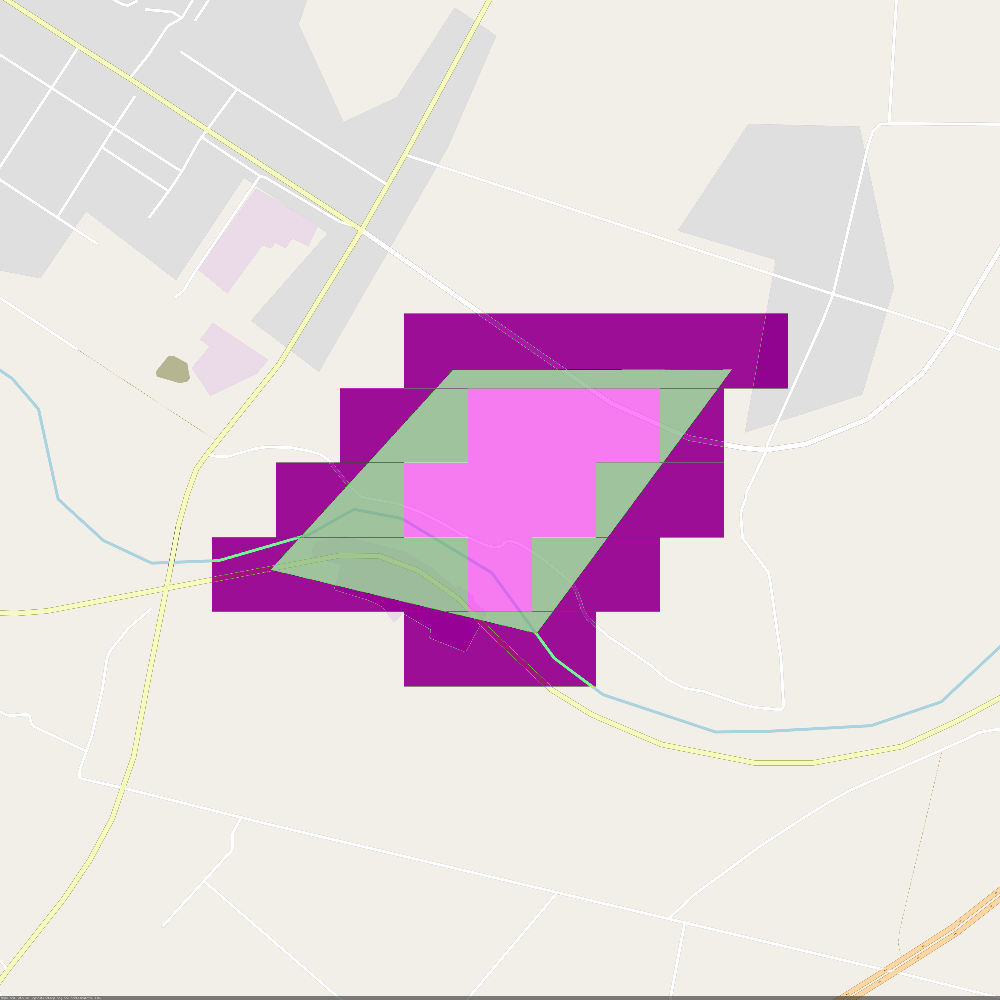
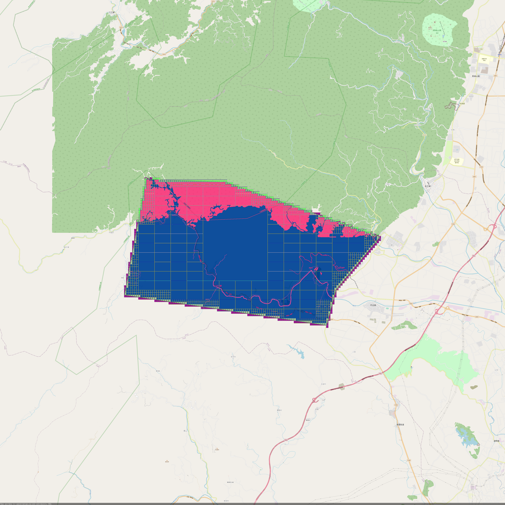

geohash+前缀树快速判断点是否在区域内

### 初始化

```go
geoTire := NewGeoTire()
```

### 添加多边形区域

```go
geoTire.Add(ploygon,igetKey)
```
值需要实现IGetKey接口

### 查询点位是否在某区域内

```go
dataList=geoTire.Get(point)
```

### 删除某区域

```go
geoTire.Del(igetKey)
```

#### 思路

将需要判断的多边形通过geohash划分，并将geohash分为两类，一种在多边形内，一种与多边形相交，把与此多边形相关的geohash放入前缀树中，判断点是否在某区域时，先将此点转化为geohash，在前缀树中寻找相关多边形的geohash,若包含类型的，直接命中，若相交类型的，通过射线法对其判断，若射线法判断为相交，则命中，否则不命中



上图粉色的方框为在多边形内部的geohash区域，而紫色的部分为与多边形相交的geohash区域

在划分geohash所属多边形时，若多边形在其内部，可逐步减短geohash长度，使命中内部的分支更短




上图为成都市范围内geohash方格划分示例